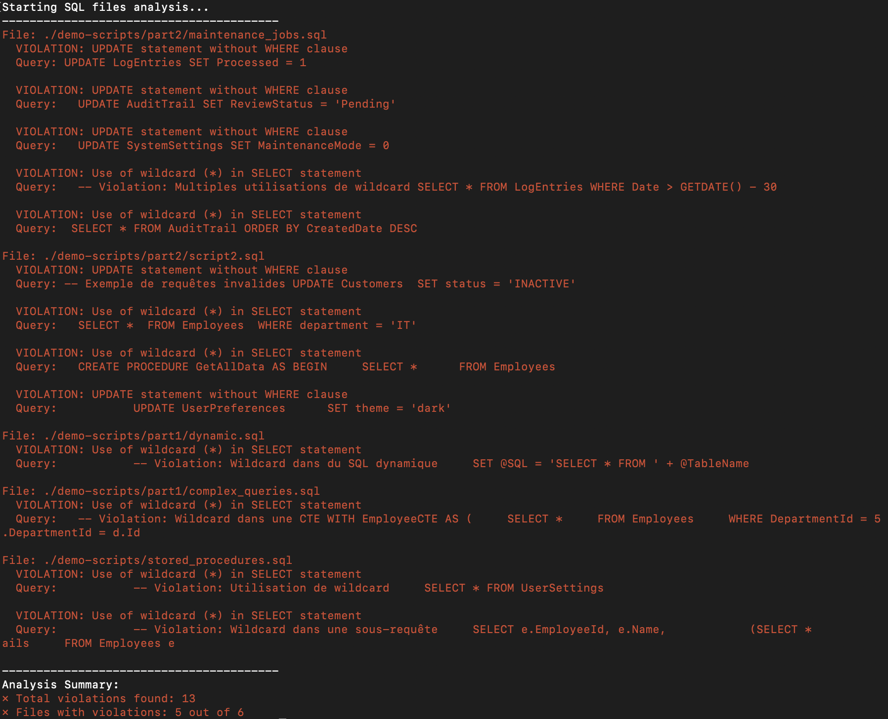

# SQL Validation
Generated with a `GenAI` in 5 minutes.

Run it with:

```shell
./sql-validator.sh
```

### Example of output


### Blocking on error
If you want to run it in your CI and make it blocking:

```shell
./sql-validator.sh || {
    echo "SQL validation failed"
    exit 1
}
```